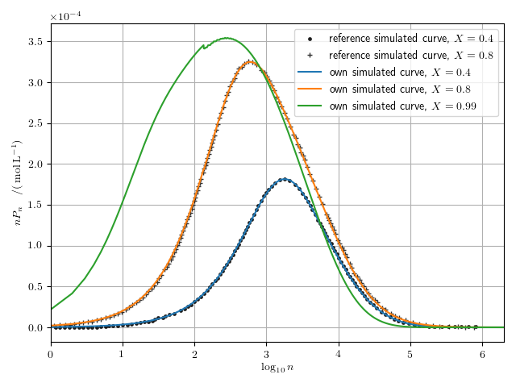
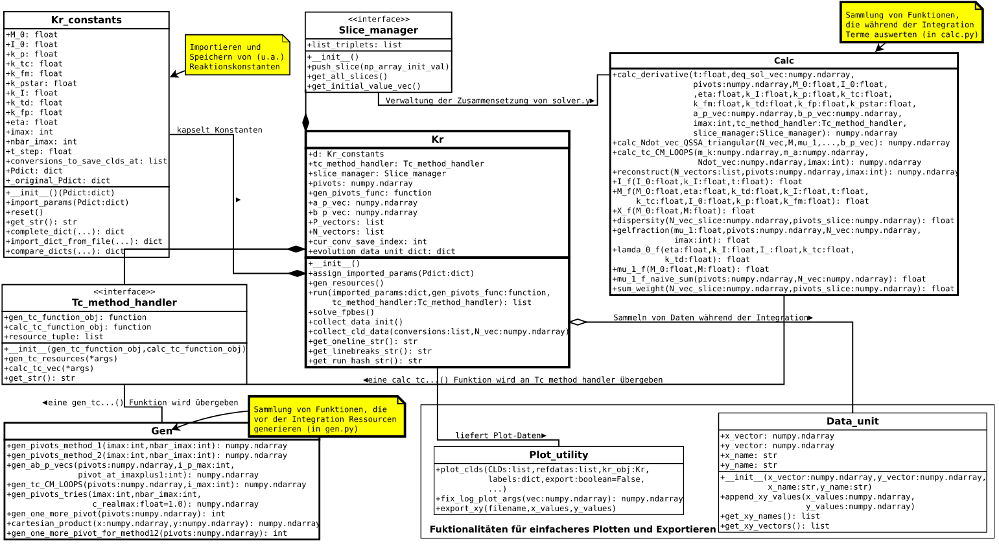

# Simulation of bulk free-radical polymer chain growth
This module implements (in python) a method for simulating the growth of polymer chains. 
It solves a large set of coupled rate equations (chemical kinetics) for the population of molecules in a mixture, 
as a function of the number of elements (monomers) of those molecules. 

This implementation is largely based on the theory laid out in [[BSM02](http://dx.doi.org/10.1002/1521-3919(20020101)11:1<22::AID-MATS22>3.0.CO;2-Z)], 
where a mathematical method by Kumar, Ramkrishna 
[[KR96a](https://doi.org/10.1016/0009-2509(96)88489-2), [KR96b](https://doi.org/10.1016/0009-2509(95)00355-X), [KR97](https://doi.org/10.1016/S0009-2509(97)00307-2)] (KR-method) 
is used to calculate the Chain-Length Distribution (CLD) during free-radical bulk polymerisation. 
This model allows to simulate the creation of a 'gel', i.e. very large, heavily branched chains.


For a more complete description of the larger context, implementation details and a discussion
of the simulation results compared to those in [[BSM02](http://dx.doi.org/10.1002/1521-3919(20020101)11:1<22::AID-MATS22>3.0.CO;2-Z)], 
feel free to contact me for a PDF copy of my bachelor thesis, written in the german language. 

## Contents of this package
- The `kr` package implements the KR-Method
- The `samples` folder contains .py files which make use the `kr` package to
  generate various plots.
  `samples/conf.json` is a configuration file containing standard simulation
  parameters ("DEFAULT") and custom simulation parameters (i.e. "FIG06").
  Custom parameters override the specified "DEFAULT" parameters.
  
### Examples
  * Varying the number of pivots used in the algorithm, the Polydispersity index (PDI) (a) and the gel fraction g (number of chains above a certain size, characterizing the gel phase) (b) of the polymer mixture are plotted as a function of the conversion X (fraction of the number of monomers having reacted polymers). Reference simulation data from [BSM02]: 
  
dispersitygelfraction.png)

  * For three different stages during the reaction process (increasing degrees of conversion X), the Chain-Length Distribution (CLD) is plotted, where n is the chain length (i.e. the size of the molecule = number of monomers built into the molecule) and P_n is the population of chains of length n in the mixture: 
  


## Dependencies
The test modules (.py files in the `samples` folder) were executed successfully 
using these libraries (and versions):

```
numpy (version 1.14.1)
scipy (version 1.0.0)
matplotlib (version 2.1.2)
numba (version 0.36.2)
```

with Python 3.5.2 on Ubuntu 16.04 LTS.

To plot the figures from the code in the `samples` folder, a full installation 
of LaTeX must be present on the system. On Ubuntu, simply do 
```
sudo apt install texlive-full
```

## Running the `samples`
To be able to execute the modules in the folder `samples`, the `kr` package 
needs to be present in python's [module search path](https://docs.python.org/3/tutorial/modules.html#the-module-search-path). 
To achieve this, add the directory where the `kr` folder (package) is located 
to the environment variable `PYTHONPATH`.

- on Linux (tested under Ubuntu 16.04 LTS.): 
  if the `kr` folder is located in `/home/chris/My_python_lib`, open a 
  linux terminal window (e.g bash) and run
  ```
	export PYTHONPATH="${PYTHONPATH}:/home/chris/My_python_lib"
  ```
  or, just navigate into this directory and run 
  ```
	export PYTHONPATH=$PYTHONPATH:$(pwd)x
  ```
  To check if the intended directory has been added to the
  Module Search Path, run
  ```
	python3 -c 'import sys; print(sys.path)'
  ```
  
- On Windows (not tested):
  if the `kr` folder is located in C:\My_python_lib, from the Windows command line, run
  ```
  set PYTHONPATH=%PYTHONPATH%;C:\My_python_lib
  ```

In order to now execute the test modules, navigate into the `samples` directory, 
```
cd samples
```
from there, execute them with e.g.
```
python3 fig4.py
```
The simulation is run and figures are produced (`.png` and `.pgf` files are put into the working directory).
When opening a fresh terminal window, the `PYTHONPATH` must be re-set according to the above instructions. 

## UML class diagram
This program was written to be extensible in order to add more reaction mechanisms to the model. To achieve this, it 
was written in a modular way. 



## References

- [BSM02]: 
```
@article {Butte2002,
author = {Butté, Alessandro and Storti,
          Giuseppe and Morbidelli, Massimo},
title = {Evaluation of the Chain Length Distribution
         in Free-Radical Polymerization, 1. Bulk Polymerization},
journal = {Macromolecular Theory and Simulations},
volume = {11},
number = {1},
publisher = {WILEY-VCH Verlag GmbH},
issn = {1521-3919},
url = {http://dx.doi.org/10.1002/1521-3919(20020101)11:1<22::AID-MATS22>3.0.CO;2-Z},
doi = {10.1002/1521-3919(20020101)11:1<22::AID-MATS22>3.0.CO;2-Z},
pages = {22--36},
keywords = {modeling, molecular weight distribution, radical polymerization},
year = {2002},
}
```
- [KR96a]: 
```
@article{KUMAR19961311,
author = "Sanjeev Kumar and D. Ramkrishna", 
title = "On the solution of population balance equations
         by discretization—I. A fixed pivot technique",
journal = "Chemical Engineering Science",
volume = "51",
number = "8",
pages = "1311 - 1332",
year = "1996",
issn = "0009-2509",
doi = "https://doi.org/10.1016/0009-2509(96)88489-2", 
}
```
- [KR96b]: 
```
@article{KUMAR19961333,
author = "Sanjeev Kumar and D. Ramkrishna", 
title = "On the solution of population balance equations
         by discretization—II. A moving pivot technique",
journal = "Chemical Engineering Science",
volume = "51",
number = "8",
pages = "1333 - 1342",
year = "1996",
issn = "0009-2509",
doi = "https://doi.org/10.1016/0009-2509(95)00355-X",
}
```

- [KR97]: 
```
@article{KUMAR19974659,
author = "Sanjeev Kumar and D. Ramkrishna", 
title = "On the solution of population balance equations by discretization—III.
         Nucleation, growth and aggregation of particles",
journal = "Chemical Engineering Science",
volume = "52",
number = "24",
pages = "4659 - 4679",
year = "1997",
issn = "0009-2509",
doi = "https://doi.org/10.1016/S0009-2509(97)00307-2",
}
```
